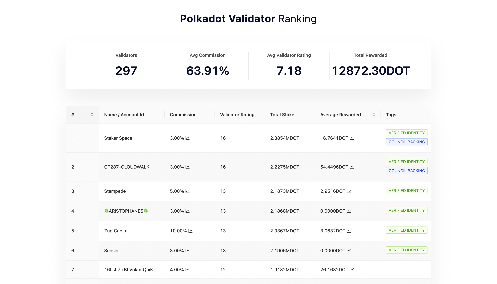
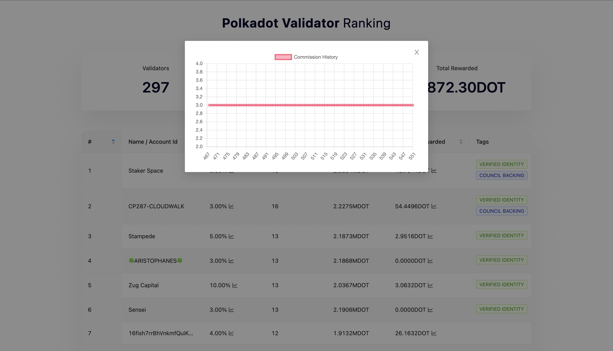
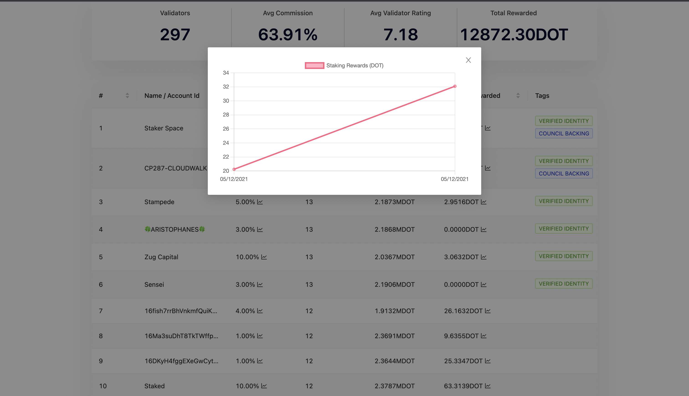
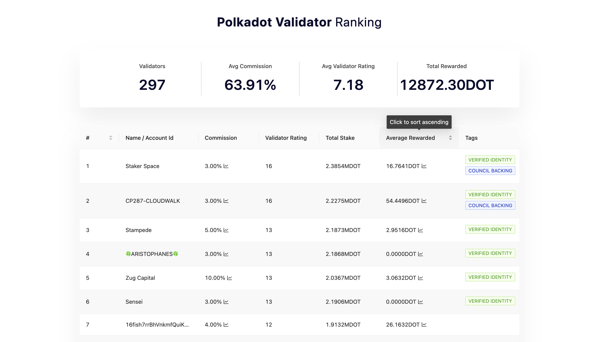

# Welcome to Polkadot Validator Ranking!

Polkadot Staking Dashboard

Polkadot Validator Ranking ranking is a new standard for rating Polkadot Validators. This ranking is based on various factors like era performance, commmissions, previous staking rewards, etc.

The ranking is based on last 5000 staking rewards

## Development

From your terminal:

```sh
npm install
npm run dev
```

This starts your app in development mode, rebuilding assets on file changes.

## Deployment

First, build your app for production:

```sh
npm run build
```

Then run the app in production mode:

```sh
npm start
```

## Screenshots

Ranked validators



Commissions History



Staking Rewards History



Sorting based on average staking rewards


